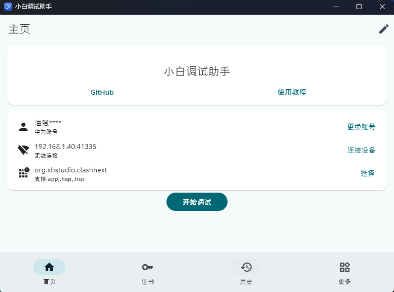

HarmonyOS NEXT作为华为全新的操作系统，与之前的版本有着根本性的不同——它不再兼容安卓APK应用，只支持原生鸿蒙应用（.hap格式）。这带来了更高的安全性和性能，但也意味着用户安装应用的途径相对有限。虽然华为应用市场正在迅速丰富其鸿蒙应用生态，但仍有不少情况需要我们从其他渠道获取应用：

* 安装华为应用市场尚未上架的应用

* 体验特定渠道的测试版本

* 安装开源社区开发的工具类应用

在这篇内容中，我们将详细介绍如何使用GitHub上的开源工具Auto-Installer在HarmonyOS NEXT设备上安装第三方应用。

<!-- truncate -->

## 准备工作

在开始之前，我们需要确保设备已做好相应准备：

1. 开启开发者模式

    * 进入“设置” > “[你的手机型号，例如Mate 70 Pro]”，进入到关于本机。

    * 连续点击“软件版本”多次，在确认后，手机会自动重启。重启成功后，手机将开启开发者模式。

2. 启用USB调试/无线调试（二选一）

    * 进入“设置 > 系统 > 开发者选项”，开启“USB调试”开关。

    * 进入“设置 > 系统 > 开发者选项”，进入“无线调试”，记录好此处的IP地址和端口，例如192.168.1.40：41335。

## 使用Auto-Installer安装应用

### 下载Auto-Installer

Auto-Installer是一个开源工具，专门为HarmonyOS NEXT设计，帮助用户安装第三方鸿蒙应用包（.hap文件）。它通过HDC连接实现应用的静默安装，绕过了官方应用市场的限制。

我们可以在GitHub的仓库中下载对应的exe安装包，地址为（需要科学上网）：https://github.com/likuai2010/auto-installer

下载完成后安装即可，安装过程中可能会提示安装Java环境，根据提示安装即可。

### 获取应用的HAP包

此处根据大家的需要，各自获取，例如从GitHub中获取需要的hap包。

### 使用Auto-Installer安装应用

进入Auto-Installer后，登录华为账号、连接设备、选择本地的HAP包，然后选择“开始调试”即可安装应用了。

如果使用上有问题，可以参考工具自带的“使用教程”。

