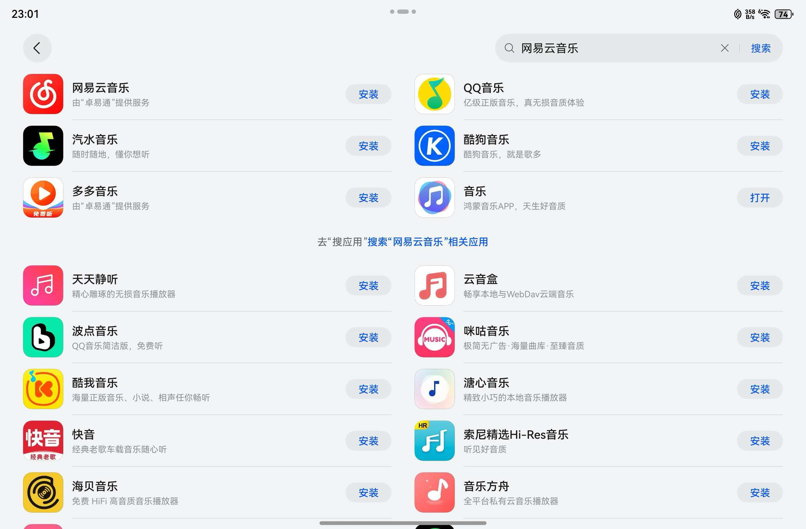
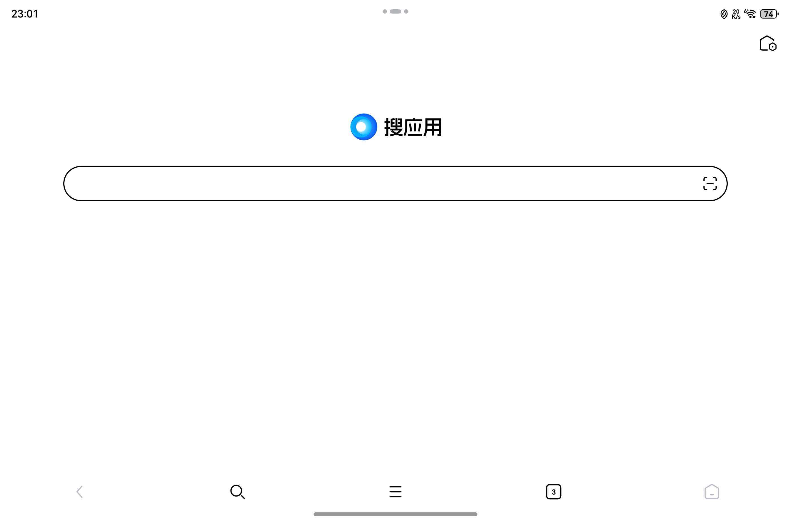
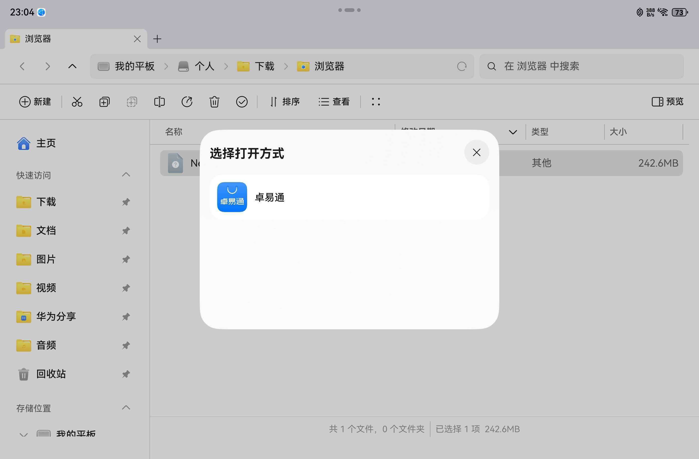

随着鸿蒙系统生态的不断发展，许多用户发现部分应用尚未推出鸿蒙原生版本。幸运的是，鸿蒙系统通过内置的“卓易通”兼容框架，依然能够顺畅运行安卓应用。本文将详细介绍四种在鸿蒙设备上安装安卓应用的方法，帮助您轻松扩展应用生态。

* 在应用市场中搜索并安装

* 在卓易通中搜索并安装

* 在“搜应用”中搜索并安装

* 直接下载APK文件并通过卓易通打开

各种方式只是获取APK文件的方式不同，本质上都是通过卓易通应用来安装和运行安卓应用。下面我们详细介绍每种方式的具体操作方法（以平板为例，手机上安装也类似）。

<!-- truncate -->

## 在应用市场中搜索并安装

这是最直接的方式，操作路径与安装鸿蒙原生应用几乎一致：

1. 打开华为/鸿蒙「应用市场」。

2. 在搜索框中输入您需要的应用名称。

3. 在搜索结果中，如果看到应用图标下方标注 “由卓易通提供服务”，说明该应用为安卓版本。

4. 点击「安装」按钮，系统将通过卓易通兼容环境自动完成安装。

安装完成后，应用会出现在桌面，并可正常使用。

## 在卓易通中搜索并安装

鸿蒙系统内置了独立的“卓易通”应用，可作为安卓应用的管理入口：

1. 在桌面找到并打开 “卓易通” 应用。

2. 进入后，您会看到一个类似应用商店的界面。

3. 直接在上方搜索栏中输入应用名称。

4. 从结果中选择并安装即可。

## 在“搜应用”中搜索并安装

卓易通还提供了一种更直接的搜索聚合方式：

1. 进入「卓易通」文件夹或者在桌面找到“搜应用” 入口。

2. 点击后会进入一个强化搜索界面，可直接输入应用名。

3. 系统会从多个来源聚合结果，选择您信任的来源进行下载安装。

## 直接下载APK文件并通过卓易通打开

如果您有安卓应用的安装包（APK文件），也可以手动安装：

1. 通过浏览器或其他渠道下载APK文件。

2. 下载完成后，点击文件，系统会提示使用 “卓易通” 打开并安装。

3. 按照提示完成安装即可。

## 总结与建议

| 方式 | 适用场景 | 安全性 |
|------|----------|--------|
| 应用市场搜索 | 日常常用应用 | 高 |
| 卓易通内搜索 | 希望集中管理安卓应用 | 高 |
| 卓易通“搜应用”功能 | 查找多渠道应用 | 中高 |
| 直接安装APK | 安装特定版本或市场未上架的应用 | 需自行判断 |

鸿蒙系统通过卓易通兼容层，为用户提供了平滑的安卓应用过渡方案。建议优先选择前三种方式，以获得更好的安全性和兼容性保障。随着鸿蒙原生应用的增多，未来我们将逐渐迈向完全原生的鸿蒙生态体验。

希望这篇博客能帮助您更好地在鸿蒙系统上使用所需应用！