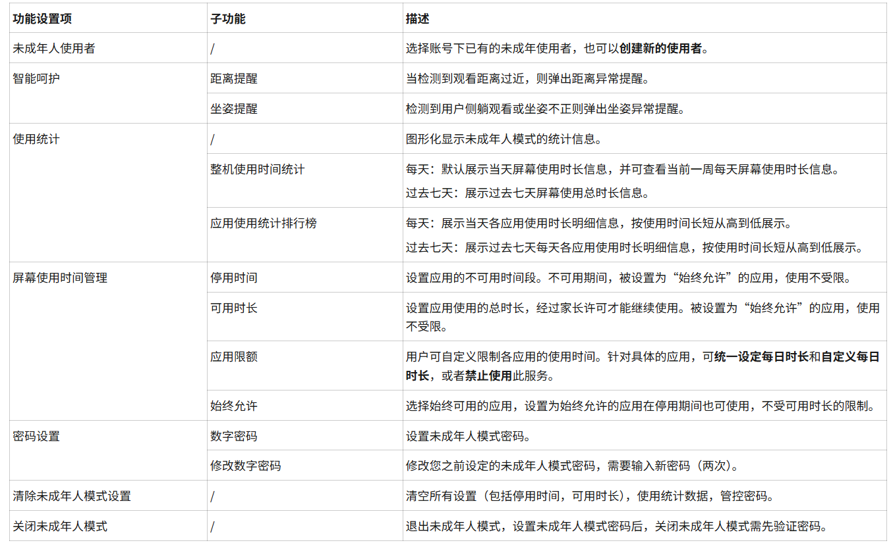

---
last_update:
  date: 2025-09-16
  author: 油腻樵夫
---

# 未成年人模式

智慧屏开启未成年人模式后，可以增强您对未成年人使用智慧屏的管控，帮助未成年人健康使用智慧屏。

## 开启未成年人模式

进入未成年人模式后，桌面布局，状态栏和标准模式保持一致。通过华为视频卡片推荐适合未成年人观看的内容，提供历史观看记录入口。桌面的家庭观影屏内容根据标准模式和未成年人模式提供不同的视频资源。不符合未成年模式使用的应用和服务卡片置灰显示。

您可通过以下任一方式开启未成年人模式：

  
| 序号| 操作方法| 图片示例|
| --- | --- | --- |
| 方式1| 在智慧屏桌面打开设置 > 未成年人模式，点击同意并开启。|  配图仅供参考，请以产品实际为准。|
| 方式2|在智慧屏桌面未成年人模式卡片中，点击开启未成年人模式。|  配图仅供参考，请以产品实际为准。|
| 方式3| 在智慧屏桌面长按遥控器菜单键打开智慧屏控制中心，点击开启。|  配图仅供参考，请以产品实际为准。|
| 方式4| 在智慧屏桌面，点击未成年模式App图标开启。|  配图仅供参考，请以产品实际为准。|
| 方式5| 通过智慧语音开启，如“小艺小艺，开启未成年人模式”。| - |

## 未成年人模式功能

开启未成年人模式后，在智慧屏桌面点击设置 > 未成年人模式，右侧页面提供未成年人模式功能设置项。

