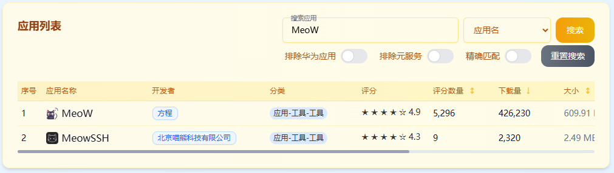

As you follow the news about HarmonyOS updates, you may feel excited about new features while scrolling through the dozens of app icons on your phone, hesitating over whether to tap the "Upgrade" button. You might be holding back because you're worried that some apps you use every day won't work on HarmonyOS.

That concern is completely understandable. After all, HarmonyOS 5 no longer supports Android apps, and the growing pains of switching ecosystems are real. The good news is that the HarmonyOS native app ecosystem has grown far faster than expected, and some practical tools can help you make a smooth transition.

<!-- truncate -->

## Search for App Compatibility Before Upgrading

Before deciding to upgrade, you can use a third-party app ecosystem dashboard to get a full picture of current app compatibility.

The specific steps are as follows:

1. Visit the third-party app marketplace dashboard website: [https://hmos.txit.top/dashboard](https://hmos.txit.top/dashboard).

2. Scroll down to the "App List" section, then enter the name of the app you care about in the search box.

   If search results appear, the app has already been adapted for HarmonyOS.

   

## Use Android Apps via DroiTong After Upgrading

When you find that an app you can't live without hasn't released a HarmonyOS version yet, tools like DroiTong offer a viable workaround.

DroiTong works by creating a secure Android runtime environment on HarmonyOS, allowing some apps that haven't been natively adapted to run normally. It may not be as polished as a native app experience, and there could be some performance overhead or minor feature limitations, but for must-have scenarios, it does solve the "have it or not" problem.

For how to install and use Android apps through DroiTong after upgrading, see [Using Android Apps on HarmonyOS](/android-app).
