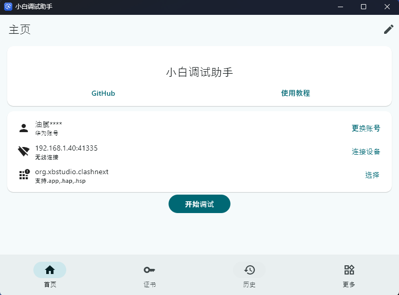

As Huawei's brand-new operating system, HarmonyOS is fundamentally different from previous versions — it no longer supports Android APK apps and only runs native HarmonyOS apps (in .hap format). That delivers better security and performance, but it also means users have relatively few ways to install apps. Although AppGallery is rapidly expanding its HarmonyOS app ecosystem, there are still plenty of situations where we need to get apps from other sources:

* Installing apps that aren't yet available in AppGallery

* Trying out test builds distributed through specific channels

* Installing utility apps developed by the open-source community

In this article, we'll walk through how to use the open-source Auto-Installer tool on GitHub to install third-party apps on a HarmonyOS device.

<!-- truncate -->

## Before You Start

Before we begin, let's make sure the device is properly prepared:

1. Enable Developer Mode

    * Go to “Settings” > “[your phone model, for example Mate 70 Pro]”, then open About phone.

    * Tap “Software version” several times in a row. After you confirm, the phone will restart automatically. Once it restarts successfully, Developer Mode will be enabled.

2. Enable USB debugging or wireless debugging (choose one)

    * Go to “Settings > System > Developer options” and turn on the “USB debugging” switch.

    * Go to “Settings > System > Developer options”, open “Wireless debugging”, and note down the IP address and port shown there, for example 192.168.1.40:41335.

## Install Apps with Auto-Installer

### Download Auto-Installer

Auto-Installer is an open-source tool built specifically for HarmonyOS that helps users install third-party HarmonyOS app packages (.hap files). It connects over HDC to install apps silently, bypassing the restrictions of the official app market.

You can download the exe installer from the GitHub repository at (a VPN is required): https://github.com/likuai2010/auto-installer

Once the download is complete, just install it. During installation, you may be prompted to install the Java environment; simply follow the prompts.

### Get the App's HAP Package

Get it however best suits your needs — for example, download the HAP package you need from GitHub.

### Install Apps with Auto-Installer

After opening Auto-Installer, sign in to your HUAWEI ID, connect your device, select the local HAP package, and then choose “Start debugging” to install the app.

If you run into any problems, refer to the tool's built-in “Usage tutorial”.