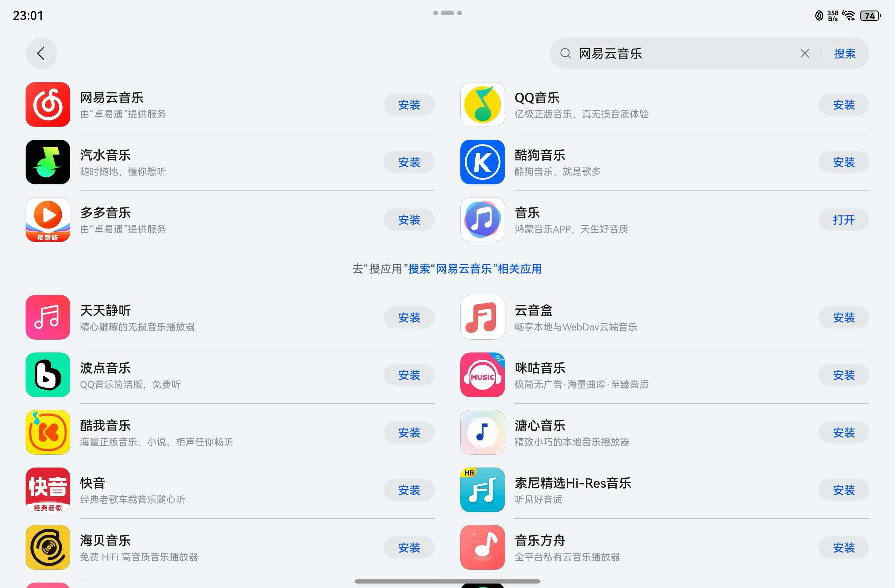
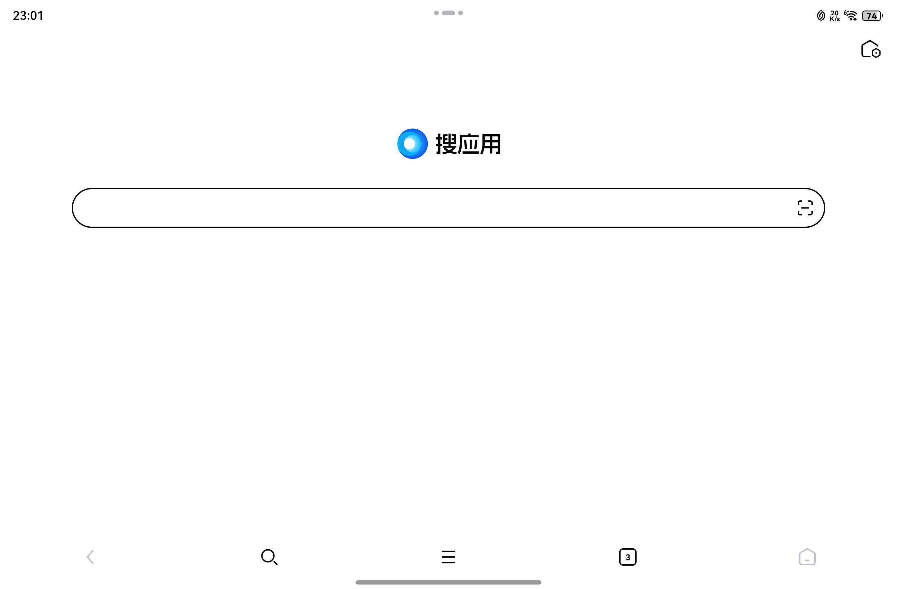
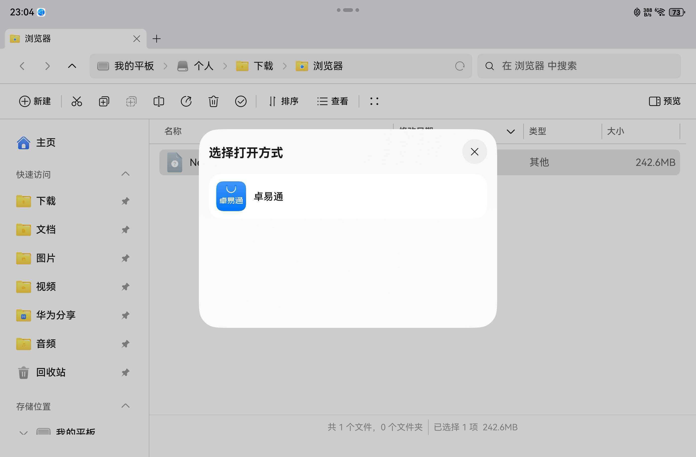

As the HarmonyOS ecosystem continues to grow, many users have found that some apps have yet to release a native HarmonyOS version. Fortunately, HarmonyOS can still run Android apps smoothly through its built-in DroiTong compatibility framework. This article introduces four ways to install Android apps on HarmonyOS devices, helping you easily expand your app ecosystem.

* Search for and install from AppGallery

* Search for and install from DroiTong

* Search for and install from "Search Apps"

* Download an APK file directly and open it with DroiTong

These methods differ only in how you obtain the APK file — in essence, they all use the DroiTong app to install and run Android apps. Below, we explain how to perform each method in detail (using a tablet as an example; installing on a phone works much the same way).

<!-- truncate -->

## Search for and install from AppGallery

This is the most straightforward method, and the steps are almost identical to installing a native HarmonyOS app:

1. Open HUAWEI/HarmonyOS "AppGallery".

2. Enter the name of the app you need in the search box.

3. In the search results, if you see "Provided by DroiTong" below the app icon, the app is an Android version.

4. Tap "Install", and the system will automatically complete the installation through the DroiTong compatibility environment.

Once installed, the app appears on the home screen and can be used normally.

## Search for and install from DroiTong

HarmonyOS includes a standalone "DroiTong" app that serves as a management portal for Android apps:

1. Find and open the "DroiTong" app on the home screen.

2. Once inside, you'll see an interface similar to an app store.

3. Enter the app name directly in the search bar at the top.

4. Select an app from the results and install it.

## Search for and install from "Search Apps"

DroiTong also offers a more direct, aggregated search method:

1. Open the "DroiTong" folder, or find the "Search Apps" entry point on the home screen.

2. Tapping it opens an enhanced search interface where you can enter an app name directly.

3. The system aggregates results from multiple sources — choose a source you trust to download and install from.

## Download an APK file directly and open it with DroiTong

If you have an installation package for an Android app (an APK file), you can also install it manually:

1. Download the APK file through a browser or another channel.

2. Once the download is complete, tap the file, and the system will prompt you to open and install it with "DroiTong".

3. Follow the prompts to complete the installation.

## Summary and recommendations

| Method | Use case | Security |
|------|----------|--------|
| Search in AppGallery | Everyday, commonly used apps | High |
| Search within DroiTong | Centralized management of Android apps | High |
| DroiTong's "Search Apps" feature | Finding apps across multiple channels | Medium-high |
| Install an APK directly | Installing a specific version or apps not listed in AppGallery | Use your own judgment |

Through the DroiTong compatibility layer, HarmonyOS gives users a smooth transition path for Android apps. We recommend choosing the first three methods first for better security and compatibility. As native HarmonyOS apps multiply, we will gradually move toward a fully native HarmonyOS ecosystem experience.

We hope this blog helps you make better use of the apps you need on HarmonyOS!