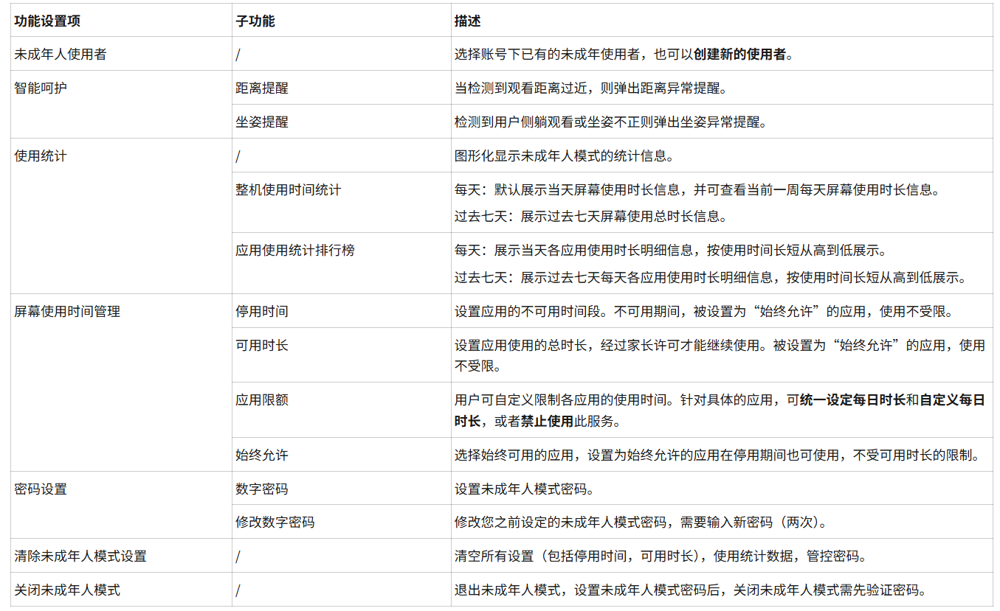

---
last_update:
  date: 2025-09-16
  author: 油腻樵夫
---

# Minor Mode

After you enable Minor Mode on your HUAWEI Vision, you can strengthen your control over minors' use of the HUAWEI Vision and help minors use it in a healthy way.

## Enabling Minor Mode

After you enter Minor Mode, the home screen layout and status bar stay the same as in Standard Mode. HUAWEI Video cards recommend content suitable for minors to watch and provide an entry point to watch history. The Family Viewing screen content on the home screen offers different video resources depending on whether Standard Mode or Minor Mode is in use. App and service cards that are not available in Minor Mode are shown in gray.

You can enable Minor Mode in any of the following ways:

| No.| Operation| Image example|
| --- | --- | --- |
| Method 1| On the HUAWEI Vision home screen, go to Settings > Minor Mode, then tap Agree and enable.|  The images are for reference only. Refer to the actual product.|
| Method 2|On the HUAWEI Vision home screen, tap Enable Minor Mode on the Minor Mode card.|  The images are for reference only. Refer to the actual product.|
| Method 3| On the HUAWEI Vision home screen, press and hold the Menu button on the remote control to open the HUAWEI Vision Control Panel, then tap  to enable it.|  The images are for reference only. Refer to the actual product.|
| Method 4| On the HUAWEI Vision home screen, tap the Minor Mode app icon  to enable it.|  The images are for reference only. Refer to the actual product.|
| Method 5| Enable it using voice commands, for example, "Celia, enable Minor Mode".| - |

## Minor Mode features

After you enable Minor Mode, go to Settings > Minor Mode on the HUAWEI Vision home screen. The page on the right provides settings for Minor Mode features.

